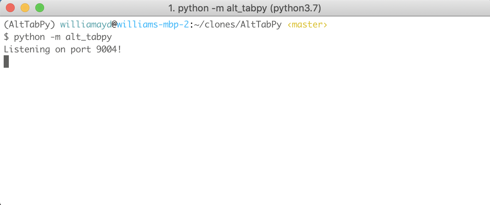
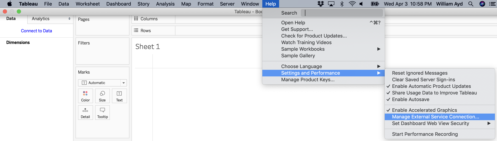
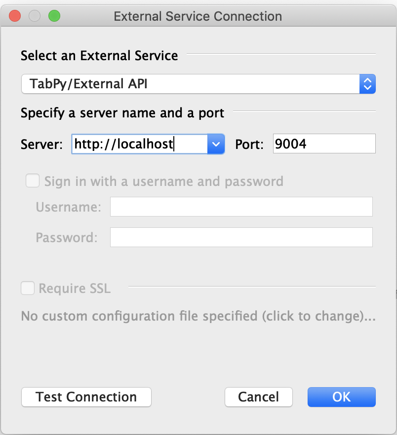
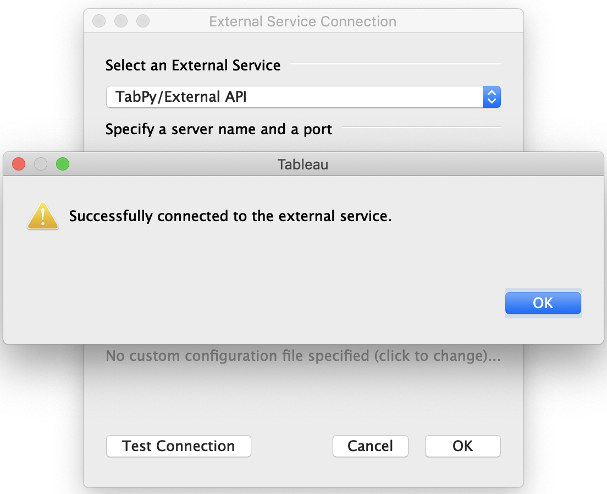

Getting Started
===============

Installing
~~~~~~~~~~

AltTabPy is available on `PyPy <https://pypi.org>`_ and can be installed via pip:

.. code-block:: bash

   pip install alt-tabpy

Once installed, you can launch the application via the command line, optionally specifying a port:

Connecting a Tableau Workbook
~~~~~~~~~~~~~~~~~~~~~~~~~~~~~
With AltTabPy running you'll need to tell Tableau Desktop where it can communicate with the service. To do so go to Help > Settings and Performance > Manage External Service Connection

On the subsequent screen specify the URL and port where the service is running:

Test the connection and if all is working well you should get a success message!

If you've gotten this far then congratulations - you are ready to start leveraging the powers of Python and Tableau together! If you haven't already be sure to check out the :doc:`Samples <samples>` for ideas on how to use these together.

