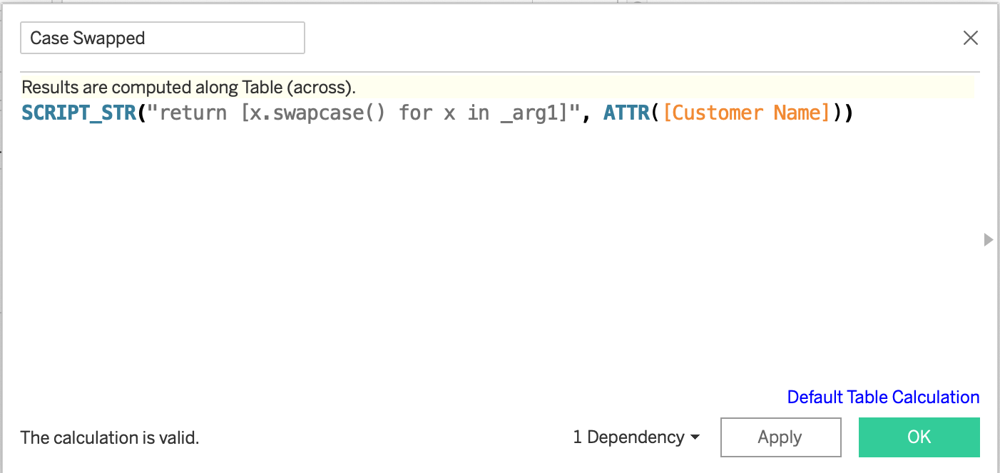
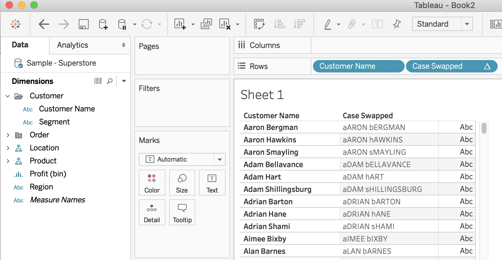
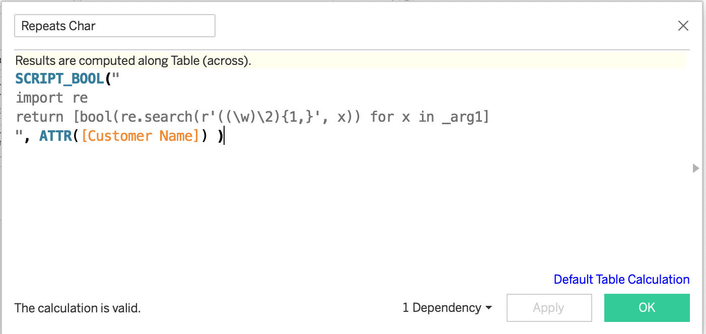
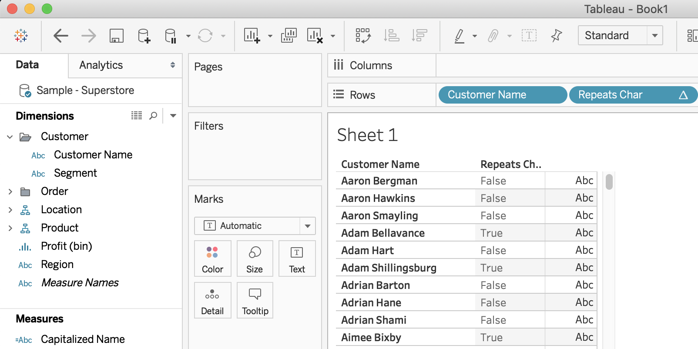

Sample Usage
============

For all of these examples we will use the `Sample - Superstore` datasource that comes with Tableau Desktop.

Reversing the Case of All Text
~~~~~~~~~~~~~~~~~~~~~~~~~~~~~~

Let's assume we wanted to reformat the `Customer Name` dimension in the sample dataset to make anything that is upper case lower and vice-versa. In Python you can achieve this using the ``swapcase`` string method as such:

.. code-block:: python

    print(x.swapcase() for x in ["John Smith", "Jane Doe"])

The equivalent function in AltTabPy looks something like this:

Note the semantics required by Tableau to achieve this. Because the result of this expression is a string we need to use ``SCRIPT_STR`` (as opposed to ``SCRIPT_BOOL``, ``SCRIPT_INT`` or ``SCRIPT_REAL``). The ``Customer Name`` dimension in this case gets passed to the function as ``_arg1``. Subsequent dimensions or measures would repeat this pattern of ``_arg2``, ``_arg3``.. ``_argn``. The code block being passed then iterates over the values, returning back a list of values for the Tableau engine to subsequently processed. The result of this appears as follows:

Replacing Characters via Regex
~~~~~~~~~~~~~~~~~~~~~~~~~~~~~~
You aren't limited to builtin commands and methods - you can also import standard and third party libraries for use in your analyses!

To illustrate, let's imagine a scenario where we wanted to identify names containing at least one letter which was repeated twice. To put this in other words, we'd like some way to flag that the names Allen, Benny and Connor differ from Al, Benjamin and Conor given the former have repeating characters whereas the latter do not.

Again in python you could do something like this:

.. code-block:: python

   import re
   bool(re.search(r'((\w)\2){1,}', 'Connor'))  # True
   bool(re.search(r'((\w)\2){1,}', 'Conor'))  # True

Here's the subsequent calculation in Tableau:

And our result confirming the calculation:

